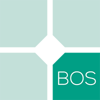

   

  <h2>Taiwanese American Professionals - Boston</h2>
   
   

***

  <h1>OUR MISSION</h1>

TAP-Boston is a springboard for driven and passionate individuals interested in Taiwanese heritage to develop as leaders and to serve Greater Boston. We provide a supportive environment where members can reflect, grow, and build meaningful relationships.

We are driven by the ideals of continuous self-improvement and the moral obligation to help others.

***

  <h3>Subscribe to our monthly newsletter</h3>
  

***

  <h3>Donate to us</h3>
    

***

<h4>Contact</h4>
| -------------:|:------------- | -------------:|:------------- |
| email icon | <a href="mailto:info@tap-boston.org">info@tap-boston.org</a> | | |
| phone icon | +1 (000) 000-0000 | | |
| address icon | 00 tap street Boston, MA 02111 | | |